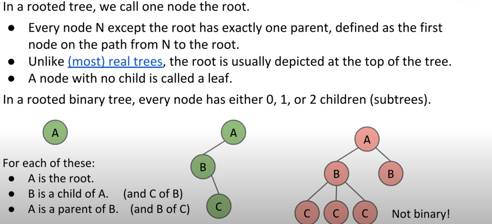
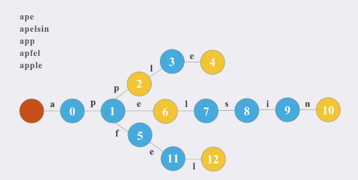

# Content

[toc]

## Tree

### 1. Principle

#### 1.1 What is Tree

- A tree consists of :
  - A set of nodes
  - A set of edges that connect those nodes.
    - Constraint: There is exactly one path between any tow nodes



#### 1.2 Height and Depth

- The `depth` of a node is how far it is from the root
- The `height` of a tree is the depth of its deepest leaf
  - Determines the worst case runtime to find a node.(height+1)
- The `average depth` of a tree is the average depth of a tree's node
  - Determines the average case runtime to find a node.(average depth +1)

## Binary Search Trees

### 1. Principle

- A tree with BST property:
  - For every node X in the tree:
    - Every key in the left subtree is less than X's key
    - Every key in the right subtree is greater than X's key
    - **The value of each node shouldn't be duplicated**

### 2. Baisc Operations

#### 2.1 Search

[700. Search in a Binary Search Tree](https://leetcode.cn/problems/search-in-a-binary-search-tree/)

```java
/**
 * Definition for a binary tree node.
 * public class TreeNode {
 *     int val;
 *     TreeNode left;
 *     TreeNode right;
 *     TreeNode() {}
 *     TreeNode(int val) { this.val = val; }
 *     TreeNode(int val, TreeNode left, TreeNode right) {
 *         this.val = val;
 *         this.left = left;
 *         this.right = right;
 *     }
 * }
 */
class Solution {
    public TreeNode searchBST(TreeNode root, int val) {
        if(root == null || root.val == val)
            return root;    
        root = val>root.val?searchBST(root.right,val):searchBST(root.left,val);
        return root;
    }
}
```

#### 2.2 Insert

- Serach for a key:
  - if not found:
    - Create new node 
    - Set appropriate link
  - if found:
    - return node

[701. Insert into a Binary Search Tree](https://leetcode.cn/problems/insert-into-a-binary-search-tree/)

```java
/**
 * Definition for a binary tree node.
 * public class TreeNode {
 *     int val;
 *     TreeNode left;
 *     TreeNode right;
 *     TreeNode() {}
 *     TreeNode(int val) { this.val = val; }
 *     TreeNode(int val, TreeNode left, TreeNode right) {
 *         this.val = val;
 *         this.left = left;
 *         this.right = right;
 *     }
 * }
 */
class Solution {
    public TreeNode insertIntoBST(TreeNode root, int val) {
        if(root == null){
            TreeNode temp = new TreeNode(val);
            return temp;
        }
        if(val<root.val)
            root.left = insertIntoBST(root.left,val);
        else if(val > root.val)
            root.right = insertIntoBST(root.right,val);
        return root;
    }
}
```

#### 2.3 Deletion

- Three Cases：

  - Deletion key has no child
    - Directly delete the node

                50                            50
             /     \         delete(20)      /   \
            30      70       --------->    30     70 
           /  \    /  \                     \    /  \ 
         20   40  60   80                   40  60   80
  - ~ has one child
    - Directly connect left/right child nodes

                50                            50
             /     \         delete(30)      /   \
            30      70       --------->    40     70 
              \    /  \                          /  \ 
              40  60   80                       60   80
  - ~ has two child
    - **Find inorder successor of the node.**

                50                            60
             /     \         delete(50)      /   \
            40      70       --------->    40    70 
                   /  \                            \ 
                  60   80                           80

[450. Delete Node in a BST](https://leetcode.cn/problems/delete-node-in-a-bst/)

```java
/**
 * Definition for a binary tree node.
 * public class TreeNode {
 *     int val;
 *     TreeNode left;
 *     TreeNode right;
 *     TreeNode() {}
 *     TreeNode(int val) { this.val = val; }
 *     TreeNode(int val, TreeNode left, TreeNode right) {
 *         this.val = val;
 *         this.left = left;
 *         this.right = right;
 *     }
 * }
 */
class Solution {
    public TreeNode findMin(TreeNode root){
        if(root.left == null)
            return root;
        return findMin(root.left);
    }
    public TreeNode deleteNode(TreeNode root, int key) {
        if(root == null)
            return null;
        if(key>root.val){
            root.right = deleteNode(root.right,key);
        }else if(key<root.val){
            root.left = deleteNode(root.left,key);
        }else{
            if(root.left == null && root.right == null){
                return null;
            }
            if(root.left !=null && root.right == null){
                return root.left;
            }
            if(root.right !=null && root.left == null){
                return root.right;
            }
            if(root.left!=null && root.right !=null){
                TreeNode temp = findMin(root.right);
                root.val = temp.val;
                root.right=deleteNode(root.right,temp.val);
                return root;
            }
        }
        return root;
    }
}
```

- Ps: What is what is successor and processor in BST inorder traverse?

```java
public int successor(TreeNode root){
  root = root.right;
  while(root.left!=null)
    root = root.left;
  return root.val;
}
```

```java
public int processor(TreeNode root){
  root = root.left;
  while(root.right!=null)
    root = root.right;
  return root.val;
}
```

#### 2.4 Time Complexity

The worst case time complexity of Search / Insertion / Delete operation is `O(h)` where h is the height of the Binary Search Tree. In worst case, we may have to travel from the root to the deepest leaf node. The height of a skewed tree may become n and the time complexity of the operations may become `O(n)`. And in the best case, the time complexity is `O(logN)`.

### 3. Ohther Operations

[235. Lowest Common Ancestor of a Binary Search Tree](https://leetcode.cn/problems/lowest-common-ancestor-of-a-binary-search-tree/)

```java
/**
 * Definition for a binary tree node.
 * public class TreeNode {
 *     int val;
 *     TreeNode left;
 *     TreeNode right;
 *     TreeNode(int x) { val = x; }
 * }
 */

class Solution {
    public TreeNode lowestCommonAncestor(TreeNode root, TreeNode p, TreeNode q) {
        if(root.val<p.val && root.val<q.val)
            root  = lowestCommonAncestor(root.right,p,q);
        if(root.val>q.val&&root.val>p.val)
            root  = lowestCommonAncestor(root.left,p,q);
        return root;
    }
}
```

[98. Validate Binary Search Tree](https://leetcode.cn/problems/validate-binary-search-tree/)

- Inorder traversal can determine whether a tree is a BST

```java
/**
 * Definition for a binary tree node.
 * public class TreeNode {
 *     int val;
 *     TreeNode left;
 *     TreeNode right;
 *     TreeNode() {}
 *     TreeNode(int val) { this.val = val; }
 *     TreeNode(int val, TreeNode left, TreeNode right) {
 *         this.val = val;
 *         this.left = left;
 *         this.right = right;
 *     }
 * }
 */
class Solution {
    boolean flag = true;
    TreeNode pre = null;
    public void midBrowse(TreeNode root){
        if(root.left !=null)
            midBrowse(root.left);
        if(pre!=null&&pre.val>=root.val)
            flag = false;
        pre = root;
        if(root.right !=null)
            midBrowse(root.right);

    }
    public boolean isValidBST(TreeNode root) {
        midBrowse(root);
        return flag;
    }
}
```

[230. Kth Smallest Element in a BST](https://leetcode.cn/problems/kth-smallest-element-in-a-bst/)

- **By using inorder traversal, we can access the values of the binary tree from small to large **

```java
/**
 * Definition for a binary tree node.
 * public class TreeNode {
 *     int val;
 *     TreeNode left;
 *     TreeNode right;
 *     TreeNode() {}
 *     TreeNode(int val) { this.val = val; }
 *     TreeNode(int val, TreeNode left, TreeNode right) {
 *         this.val = val;
 *         this.left = left;
 *         this.right = right;
 *     }
 * }
 */
class Solution {
    int count;
    int res = 0;
    public void browse(TreeNode root){
        if(root==null)
            return ;
        browse(root.left);
        count--;
        if(count==0)
            res = root.val;
        browse(root.right);
    }
    public int kthSmallest(TreeNode root, int k) {
        count = k;
        browse(root);
        return res;
    }
}
```

[99. Recover Binary Search Tree](https://leetcode.cn/problems/recover-binary-search-tree/)

```java
/**
 * Definition for a binary tree node.
 * public class TreeNode {
 *     int val;
 *     TreeNode left;
 *     TreeNode right;
 *     TreeNode() {}
 *     TreeNode(int val) { this.val = val; }
 *     TreeNode(int val, TreeNode left, TreeNode right) {
 *         this.val = val;
 *         this.left = left;
 *         this.right = right;
 *     }
 * }
 */

/*
This question has two conditions:
if the sequnce is:
1 [6] 3 4 [5] 2 7
There are two postions dissatisfy the BST property eg.6>3,5>2
if the sequnce is:
1 [3] [2] 4 5 6 7
Only one postion dissatisfy the BST property
So in this question, we need to find the first node(only judge once) and second node(judge one or twice). And then change the val;
*/

class Solution {
    TreeNode pre = null;
    boolean flag = true;
    TreeNode first  = null;
    TreeNode second = null;
    public void inorderTraversal(TreeNode root){
        if(root==null)
            return;
        inorderTraversal(root.left);
        if(pre!=null && pre.val>root.val){
            if(flag){
                first = pre;
                flag = false;
            }
            second = root;
        }
        pre = root;
        inorderTraversal(root.right);
    }
    public void recoverTree(TreeNode root) {
        inorderTraversal(root);
        int temp = first.val;
        first.val = second.val;
        second.val = temp;
    }
}
```

## Trie

### 1. Principle

#### 1.1 What is Trie

The following definition is from Wikipedia.

> In computer science, trie, also known as prefix tree or dictionary tree, is an ordered tree used to store associative arrays, in which the key is usually a string. Different from binary search tree, the key is not directly saved in the node, but determined by the location of the node in the tree. All descendants of a node have the same prefix, that is, the string corresponding to the node, while the root node corresponds to an empty string. In general, not all nodes have corresponding values, only the key corresponding to the leaf node and some internal nodes have related values.



#### 1.2 Why we use it

1. We can use this data structue to store the string.
2. If we have a string list and we have a target string, we can use it to find whther the target string in the string list. And also we cam use it to find whether the target string is other string's prefix.
3. We can count the number of occurrences of each string through Trie.

#### 1.3 Advantage

1. The efficiency of insertion and query is very high, both are O(m), where m is the length of the string to be inserted/queried.
2. Different keywords in the Trie tree will not conflict.
3. Trie trees can only have similar hash collisions when a keyword is allowed to associate multiple values.
4. Trie tree does not need to find hash value, it has faster speed for **short string**. Usually, it is necessary to traverse the string to find the hash value.
5. Trie tree can sort keywords in lexicographic order.

### 2. Representation

- Static representation
  - We use a two-dimensional array trie to store characters
  - We use cnt to mark whether this character is the end of a string and it also show the number of occurrences of this string
  - We use idx to represent the number of each node

```java
class Trie {
    int N = 100010; 
    int[][] trie;
    int[] cnt;
    int idx;

    public Trie() {
        trie = new int[N][26];
        cnt = new int[N];
        idx = 0;
    }

    public void insert(String s) {
        int p = 0;
        for (int i = 0; i < s.length(); i++) {
            int temp = s.charAt(i) - 'a';
            if (trie[p][temp] == 0) 
                trie[p][temp] = ++idx;
            p = trie[p][temp];
        }
        cnt[p]++;
    }

    public boolean search(String s) {
        int p = 0;
        for (int i = 0; i < s.length(); i++) {
            int temp = s.charAt(i) - 'a';
            if (trie[p][temp] == 0) return false;
            p = trie[p][temp];
        }
        return cnt[p]>0?true:false;
    }

    public boolean startsWith(String s) {
        int p = 0;
        for (int i = 0; i < s.length(); i++) {
            int temp = s.charAt(i) - 'a';
            if (trie[p][temp] == 0) 
                return false;
            p = trie[p][temp];
        }
        return true;
    }
}
```

- Dynamic presentation

```java
class Trie {
    class TrieNode {
        boolean end;
        TrieNode[] tns = new TrieNode[26];
    }

    TrieNode root;
    public Trie() {
        root = new TrieNode();
    }

    public void insert(String s) {
        TrieNode p = root;
        for(int i = 0; i < s.length(); i++) {
            int u = s.charAt(i) - 'a';
            if (p.tns[u] == null) p.tns[u] = new TrieNode();
            p = p.tns[u]; 
        }
        p.end = true;
    }

    public boolean search(String s) {
        TrieNode p = root;
        for(int i = 0; i < s.length(); i++) {
            int u = s.charAt(i) - 'a';
            if (p.tns[u] == null) return false;
            p = p.tns[u]; 
        }
        return p.end;
    }

    public boolean startsWith(String s) {
        TrieNode p = root;
        for(int i = 0; i < s.length(); i++) {
            int u = s.charAt(i) - 'a';
            if (p.tns[u] == null) return false;
            p = p.tns[u]; 
        }
        return true;
    }
}

```

### 3. Application

[720. Longest Word in Dictionary](https://leetcode.cn/problems/longest-word-in-dictionary/)

```java
class Solution {
    int N=100010;
    int[][] trie;
    int[] cnt;
    int idx = 0;
    boolean flag = false;
    public void buildTrie(String s){
        int p=0;
        for(int i=0;i<s.length();i++){
            int temp = s.charAt(i)-'a';
            if(trie[p][temp]==0){
                trie[p][temp] = ++idx;
            }
            p = trie[p][temp];
        }
        cnt[p]++;
    }
    public boolean findW(String s){
        int p=0;
        for(int i=0;i<s.length();i++){
            int temp = s.charAt(i)-'a';
            if(trie[p][temp]==0)
                return false;
            p = trie[p][temp];
            if(cnt[p]>0)
                continue;
            else
                return false;
        }
        return true;
    }
    public String longestWord(String[] words) {
        trie = new int[N][26];
        cnt = new int[N];
        for(String a:words)
            buildTrie(a);
        int len = -1;
        String res = "";
        for(String a:words){
            if(a.length()<len)
                continue;
            if(res.compareTo(a)>0 && res.length()==a.length()&&findW(a)){
                res = a;
            }
            if(findW(a)&&a.length()>len){
                res = a;
                len = res.length();
                continue;
            }
        }
        return res;
    }
}
```

[212. Word Search II](https://leetcode.cn/problems/word-search-ii/)

- Tire+DFS

```java
class Solution {
    int[][] trie;
    int[] cnt;
    int idx = 0;
    boolean flag = false;
    int[] dx={-1,1,0,0};
    int[] dy={0,0,-1,1};
    public void insertTrie(String s){
        int p=0;
        for(int i=0;i<s.length();i++){
            int temp = s.charAt(i)-'a';
            if(trie[p][temp]==0)
                trie[p][temp] = ++idx;
            p = trie[p][temp];
        }
        cnt[p]++;
    }
    public boolean findW(String s){
        if(s.length()==0)
            return false;
        int p=0;
        for(int i=0;i<s.length();i++){
            int temp = s.charAt(i)-'a';
            if(trie[p][temp]==0)
                return false;
            p = trie[p][temp];
        }
        if(cnt[p]>0){
            flag = true;
            cnt[p]--;
        }
        return true;
    }
    public void dfs(int row, int col, char[][] board, List<String> res, String path){
        if(row<0||row>=board.length||col<0||col>=board[0].length||board[row][col]=='#')
            return;
        char temp = board[row][col];
        path+=temp;
        if(findW(path)){
            if(flag)
                res.add(path);
            flag = false;
        }
        else
            return ;
        board[row][col]='#';
        for(int i=0;i<4;i++){
            int curRow=row+dx[i];
            int curCol=col+dy[i];
            dfs(curRow,curCol,board,res,path);
        }
        board[row][col]=temp;
    }
    public List<String> findWords(char[][] board, String[] words) {
        trie = new int[100010][26];
        cnt = new int[100010];
        List<String> res = new ArrayList<String>();
        for(String x:words)
            insertTrie(x);
        for(int i=0;i<board.length;i++){
            for(int j=0;j<board[0].length;j++){
                String path="";
                dfs(i,j,board,res,path);
            }
        }
        return res;
    }
}
```


